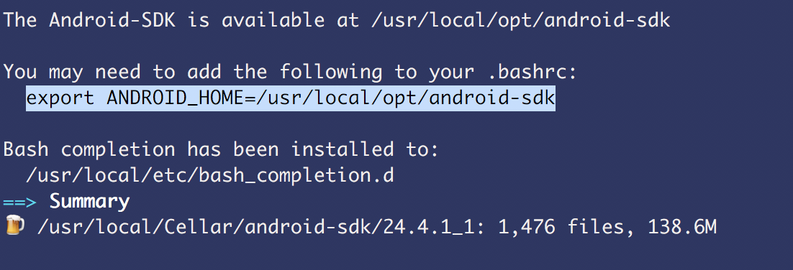
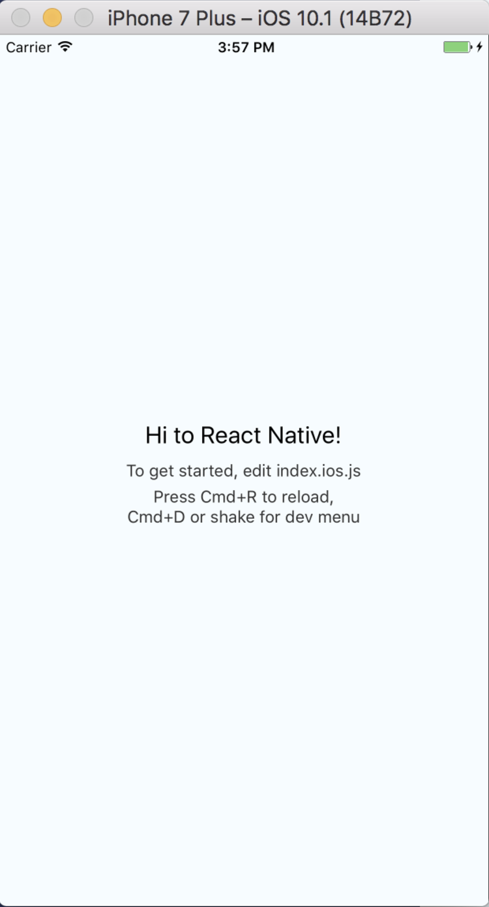

# Setup React Native for iOS and Android development on Mac

### Install XCode
xCode you need for to package your code + React Native library into an installable app and run it on the iOS simulator.

- navigate to your spotlight ```(command + space)``` type **app store**, search for **xCode** and click get! Even if you have Xcode is worth updating to the newest version. I had series of problems because of the outdated version. Installation might take a while.

### Install Homebrew
Program to install programs :) e.g Node etc.

If you already have homebrew installed you can run update: ```brew update```

- navigate to http://brew.sh/, copy the script provided and execute that script in your command line/terminal.

### Install Node/NPM
Node runs Javascript outside of the browser. **NPM** is used for installing/managing dependencies. NPM and Node come together.

Run: ```brew install node```

Make sure you have at least 4.5 version installed.

You can also install node using nvm which gives you ability to switch between different versions of node.

Steps to install node using ```nvm```

- navigate to https://github.com/creationix/nvm#installation
- copy the following script and execute on your terminal: ```curl -o- https://raw.githubusercontent.com/creationix/nvm/v0.32.1/install.sh | bash```
- close and open terminal to start using ```nvm```
- to check what node version you have installed type: ```nvm ls```
- to install the latest version and set as your default: ```nvm install node && nvm alias default node ``` or install specific version ```nvm install 6.9.1```
- set as default specific version: ```nvm alias default v6.9.1```
- switch between different node version: ```nvm use v7.0.0```


### Install watchman
Watchman watches files on the hard drive and waits for them to change.

Run ```brew install watchman```

### Install flow

Run ```brew install flow```

### RN cli
React Native command line interface. Used to generate new react native projects.

Run ```npm install -g react-native-cli```


## Steps to set up Android development

If you already have Android Studio installed and SDK I highly recommend that you uninstall and start fresh again if you didn't manage to make it work previously.

Check out this link to uninstall Android Studio: ```http://stackoverflow.com/questions/17625622/how-to-completely-uninstall-android-studio```

### Install JDK

- navigate to http://www.oracle.com/technetwork/java/javase/downloads/index-jsp-138363.html

- click on ```JDK download```


- click on Accept Licence Agreement... and pick jdk version for your system


- after completing download you should be able to install it (follow the instruction)


### Install Android SDK

Run ```brew install android-sdk```

Copy the path to android-sdk location and paste it in your .bashrc or .zshrc



Using bash or zsh:
- ```nano ~/.bashrc```  or ```nano ~/.zshrc``` nano is the editor, you can use any other editor.

- paste copied location somewhere in your .bashrc or .zshrc file:


Close and open terminal or run ```source ~/.bashrc``` / ```source ~/.zshrc```

### Configure your Android SDK

- type in your terminal: ```android``` If you see the following window that means the installation was successful.


- official docs in regards to SDK configuration (a bit outdated) https://facebook.github.io/react-native/releases/0.24/docs/android-setup.html#configure-your-sdk

- Install by ticking the box next to the following:
  - Android SDK Tool, Platform Tools, Build Tools, Android SDK of your choice, always install images like: Intel x 86 Image System. In Extra section install : Android Support Repository. These are essentials.


It is up to you which Android you want to install. I install by mistake Android TV Intel etc. You don't need to do that.


Click install, accept Licence. Depending what you choose and internet connection the installation might take a while.


After completed installation close the SDK window.

### Create your virtual device via either Genymotion or Android Virtual Device (avd)

- official docs https://facebook.github.io/react-native/releases/0.24/docs/android-setup.html#install-genymotion

- you need to install virtualbox before installing Genymotion

- navigate to https://www.virtualbox.org/wiki/Downloads, install virtualbox for your operating system and follow the installation process

- open https://www.genymotion.com/ and sign up

- hit the Download link and start installation

- create new virtual device


### Create react native demo app

- create demo app, run: ```react-native init demoApp```

You should see something like this:


- ```cd demoApp```

- start server : ```npm start```

### iPhone simulator

- open second tab and run ```open ios/demoApp.xcodeproj``` or ```react-native run-ios```

- if you decide to run a first command, the xCode will open and will perform initial installations
- hit the run icon at the top
- you can scale down the simulator window by navigating to window -> scale -> 50%

Close xCode and open the demoApp from the screen of the simulator.

- make some changes in index.ios.js, go back to your simulator click ```command + R``` to see the changes.



- ```command + Q``` to quit simulator

### Android simulator

- start genymotion virtual device by clicking the Start button


- open a third tab and type: ```react-native run-android```

If you see this error:


To solve it go to genymotion Settings tab:


Under ADB click on Use custom Android SDK and paste the location of your SDK from .bashrc or .zshrc.
In my case I had to type: ```/usr/local/opt/android-sdk```

This solved the issue.

Open again android simulator and run ```react-native run-android``` in your terminal again.

If all good you should see:


You now should see two simulators running the same project:


## References:
- Great talk: scaling React Native https://www.youtube.com/watch?v=abSNo2P9mMM&spfreload=10

- Official installation guide: https://facebook.github.io/react-native/docs/getting-started.html#content
